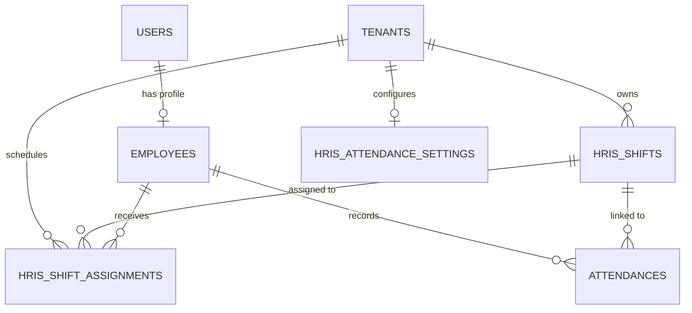
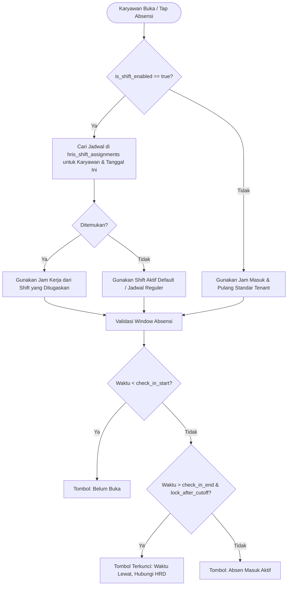
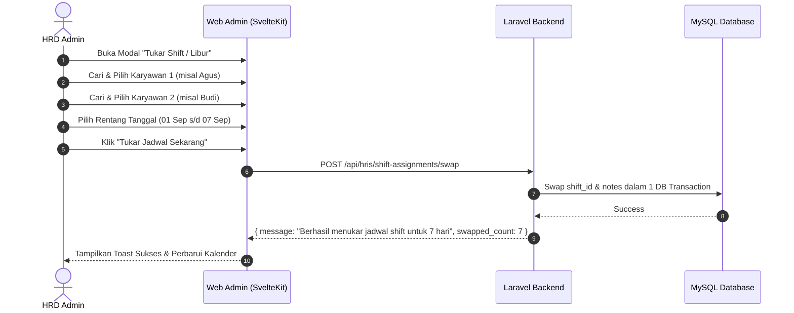

# DOKUMENTASI SISTEM SHIFT KERJA, ROSTER KALENDER, & ROTASI OTOMATIS

Dokumentasi ini menjelaskan secara menyeluruh arsitektur, skema basis data, logika bisnis, algoritma rotasi otomatis (*auto-generate*), fitur tukar jadwal (*shift swap*), validasi absensi waktu (*time-window check*), dan integrasi API antara backend Laravel, frontend Web Admin (SvelteKit), serta Mobile App (NATRA HRIS).

---

## 1. Arsitektur & Skema Basis Data

Sistem shift dan aturan kehadiran didukung oleh 3 tabel utama di backend:

### A. Tabel `hris_shifts` (Master Data Shift)
Menyimpan konfigurasi shift yang dapat dibuat fleksibel oleh HRD (contoh: Shift Pagi, Shift Siang, Shift Malam).

| Kolom | Tipe | Keterangan |
| :--- | :--- | :--- |
| `id` | BIGINT (PK) | Auto-increment primary key |
| `tenant_id` | BIGINT (FK) | ID Admin / Tenant pemilik data |
| `name` | VARCHAR(100) | Nama Shift (*misal: "Shift Pagi Operasional"*) |
| `code` | VARCHAR(50) | Kode Shift unik (*misal: "SHF-PAGI"*) |
| `check_in_start` | TIME | Jam buka tombol absen masuk (*misal: 06:00*) |
| `work_start_time` | TIME | Jam masuk resmi / target hadir (*misal: 07:00*) |
| `late_tolerance_time` | TIME | Batas toleransi terlambat (*misal: 07:15*) |
| `check_in_end` | TIME | Batas cut-off tombol masuk (*misal: 08:00*) |
| `work_end_time` | TIME | Jam pulang resmi (*misal: 15:00*) |
| `is_night_shift` | BOOLEAN | Penanda shift malam (lintas tengah malam) |
| `color` | VARCHAR(20) | Kode HEX warna label kalender (*misal: "#3b82f6"*) |
| `is_active` | BOOLEAN | Status aktif / nonaktif |

---

### B. Tabel `hris_shift_assignments` (Roster Penjadwalan Shift Karyawan)
Menyimpan penugasan shift harian untuk setiap karyawan per tanggal.

| Kolom | Tipe | Keterangan |
| :--- | :--- | :--- |
| `id` | BIGINT (PK) | Auto-increment primary key |
| `tenant_id` | BIGINT (FK) | ID Tenant |
| `employee_id` | BIGINT (FK) | ID Karyawan penerima jadwal |
| `shift_id` | BIGINT (FK) | ID Shift yang ditugaskan |
| `date` | DATE | Tanggal penugasan (*format: YYYY-MM-DD*) |
| `notes` | VARCHAR(255) | Catatan penugasan / riwayat rotasi/tukar shift |

> **Indeks Unik**: Komposit `UNIQUE(tenant_id, employee_id, date)` memastikan **1 karyawan tidak pernah mengalami tabrakan jadwal (collision-free)** pada tanggal yang sama.

---

### C. Tabel `hris_attendance_settings` (Aturan Kehadiran Tenant)
Menyimpan aturan sistem shift dan toleransi kehadiran global bagi perusahaan.

| Kolom | Tipe | Keterangan |
| :--- | :--- | :--- |
| `is_shift_enabled` | BOOLEAN | `true` = Menggunakan Multi-Shift Roster, `false` = Jam Kerja Reguler Standar |
| `check_in_start` | TIME | Jam buka absen masuk standar (default: 07:00) |
| `work_start_time` | TIME | Jam masuk kerja resmi standar (default: 08:00) |
| `late_tolerance_time` | TIME | Batas toleransi keterlambatan (default: 08:15) |
| `check_in_end` | TIME | Batas waktu cut-off tombol absen (default: 08:30) |
| `lock_after_late_cutoff` | BOOLEAN | Kunci tombol absen jika lewat batas cut-off |
| `late_cutoff_policy` | VARCHAR(50) | Status jika terkunci (`empty` / `absent`) |
| `work_end_time` | TIME | Jam pulang kerja standar (default: 17:00) |
| `min_checkout_at_work_end` | BOOLEAN | Mencegah absen keluar sebelum jam pulang |
| `require_geofence_checkout` | BOOLEAN | Wajib berada di radius geofence kantor saat tap keluar |

---

## 2. Resolusi Jadwal Efektif (*Dynamic Schedule Resolution*)

Ketika karyawan membuka aplikasi mobile atau melakukan absensi, backend menentukan jadwal efektif (*effective schedule*) melalui method `AttendanceController::getEffectiveSchedule()`:

---

## 3. Logika Validasi Absensi Waktu & Geofence

### A. Validasi Absen Masuk (*Check-In Validation*):
1. **Terlalu Awal (*Too Early*)**: Jika jam saat ini kurang dari `check_in_start`, tombol absensi di mobile dinonaktifkan dengan label *"Belum Buka (Buka pukul XX:XX WIB)"*.
2. **Tepat Waktu (*On-Time*)**: Jika jam saat ini berada di antara `check_in_start` s/d `late_tolerance_time`, status absensi dicatat sebagai **`present` (Hadir Tepat Waktu)**.
3. **Terlambat (*Late*)**: Jika jam saat ini melewati `late_tolerance_time` tetapi masih sebelum `check_in_end`, absensi dicatat sebagai **`late` (Terlambat)**.
4. **Lewat Batas Cut-Off (*Locked Late Cutoff*)**: Jika jam saat ini melewati `check_in_end` dan opsi `lock_after_late_cutoff` aktif, karyawan **tidak dapat absen mandiri**. Karyawan harus melapor ke HRD, dan HRD dapat mencatat/menyesuaikan kehadiran secara manual di halaman Admin Kehadiran.

### B. Validasi Absen Keluar (*Check-Out Validation*):
1. **Wajib Minimal Jam Pulang**: Jika opsi `min_checkout_at_work_end` aktif dan jam saat ini masih sebelum `work_end_time`, sistem menolak check-out dengan pesan *"Jam pulang kerja resmi adalah pukul XX:XX WIB. Absen keluar dapat dilakukan minimal pada jam pulang."*
2. **Kepatuhan Geofence Saat Pulang**: Jika `require_geofence_checkout` aktif, karyawan harus berada di dalam radius geofence kantor saat melakukan check-out.

---

## 4. Mesin Auto-Generate Roster Cerdas (*Smart Auto-Generate Engine*)

Fitur **⚡ Auto-Generate Roster** dirancang untuk mengotomatisasi penyusunan jadwal kerja satu bulan penuh atau rentang tanggal tertentu secara instan.

### A. Pola Rotasi yang Didukung:
1. **Rotasi Bergilir Mingguan (*Weekly Rolling Shifts*)**:
   * Menghitung offset minggu: `$weekOffset = floor($date->diffInWeeks($startDate))`.
   * Indeks shift karyawan bergeser setiap hari Senin:
     $$\text{shiftIndex} = (\text{employeeIndex} + \text{weekOffset}) \pmod{\text{totalShifts}}$$
   * *Contoh 2 Shift (Pagi, Siang)*:
     * Minggu 1: Tim A (Pagi), Tim B (Siang)
     * Minggu 2: Tim A (Siang), Tim B (Pagi)
     * Minggu 3: Tim A (Pagi), Tim B (Siang)
2. **Distribusi Seimbang (*Balanced Daily Split*)**:
   * Membagi jumlah karyawan secara proporsional dan merata ke dalam seluruh shift yang aktif di setiap tanggal kerja:
     $$\text{shiftIndex} = \text{employeeIndex} \pmod{\text{totalShifts}}$$
3. **Shift Tetap (*Fixed Shift*)**:
   * Menetapkan satu master shift seragam untuk seluruh karyawan yang dipilih pada hari kerja.

### B. Aturan Hari Libur (*Day-Off Rules*):
* **Hari Libur Tetap**: HRD dapat memilih hari libur mingguan (contoh: Minggu libur, atau Sabtu & Minggu libur).
* **Rotasi Hari Libur Bergilir (*Rotating Day-Off*)**:
  * Dirancang untuk industri yang beroperasi 24/7 non-stop.
  * Setiap karyawan mendapatkan jatah libur bergantian pada hari yang berbeda agar operasional kantor tetap terpenuhi setiap hari.

---

## 5. Fitur Tukar Shift Antar Karyawan (*Schedule Swap Engine*)

Memungkinkan HRD menukar jadwal shift kerja dan hari libur antara dua orang karyawan (`employee_id_1` dan `employee_id_2`) pada rentang tanggal tertentu:

---

## 6. Daftar API Endpoints

Semua endpoint shift dan aturan kehadiran terlindungi middleware autentikasi `auth:sanctum`.

### 1. Aturan Kehadiran & Shift Global
* **`GET /api/hris/attendance-settings`**: Mengambil konfigurasi jam kerja dan switch shift tenant.
* **`POST /api/hris/attendance-settings`**: Menyimpan konfigurasi toleransi, cut-off, dan jam kerja.

### 2. Master Data Shift
* **`GET /api/hris/shifts`**: Mengambil seluruh master shift milik tenant.
* **`POST /api/hris/shifts`**: Membuat master shift baru.
* **`PUT /api/hris/shifts/{id}`**: Memperbarui master shift.
* **`DELETE /api/hris/shifts/{id}`**: Menghapus atau menonaktifkan master shift.

### 3. Penjadwalan & Roster
* **`GET /api/hris/shift-assignments`**: Mengambil daftar roster jadwal shift (mendukung filter `month`, `year`, `start_date`, `end_date`, `employee_id`).
* **`POST /api/hris/shift-assignments`**: Menetapkan jadwal shift secara manual (tunggal / massal).
* **`POST /api/hris/shift-assignments/auto-generate`**: Eksekusi mesin auto-generate roster dengan rotasi bergilir.
* **`POST /api/hris/shift-assignments/swap`**: Menukar jadwal shift antara dua karyawan.
* **`DELETE /api/hris/shift-assignments/{id}`**: Menghapus satu jadwal penugasan shift.

### 4. Sinkronisasi Mobile App
* **`GET /api/attendances/today`**: Mengembalikan data absensi hari ini, jadwal efektif (`schedule`), array roster mingguan (`weekly_roster` 7 hari Sen-Min), label bulan aktif (`current_month_label`), serta status tombol (`can_check_in`, `window_status`, `window_message`).

---

## 7. Kesimpulan & Keunggulan Arsitektur

1. **Fleksibel**: Mendukung perusahaan dengan 1 jadwal standar (reguler) maupun perusahaan multi-shift kompleks (pagi/siang/malam).
2. **Bebas Tabrakan (*Collision-Free*)**: Menjamin integritas data kalender sehingga tidak ada jadwal tumpang tindih.
3. **Efisiensi HRD**: Fitur *Auto-Generate* dan *1-Klik Centang Semua* memangkas waktu pembuatan jadwal kerja bulanan dari berjam-jam menjadi hitungan detik.
4. **Kepatuhan Disiplin Tinggi**: Validasi waktu *real-time* mencegah manipulasi jam masuk dan jam pulang oleh karyawan di lapangan.
